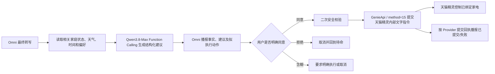

# 天猫智家·千问智能语音助手

> **Tmall Smart Home Qwen Voice Assistant**

面向天猫智慧工控屏、Android 终端和 H5 的实时语音助手系统。项目在 RuoYi 前后端分离框架基础上，接入阿里云百炼 Qwen3.5 Omni 实时语音模型，提供账号体系、实时双向语音、文字对话、跨会话长期记忆、T10S 本机低风险智能家居指令、消费者端应用和运营管理后台。

| 项目属性 | 当前值 |
| --- | --- |
| 产品名称 | 天猫智家·千问智能语音助手 |
| English name | Tmall Smart Home Qwen Voice Assistant |
| 产品版本 | **v1.2.1** |
| 版本更新时间 | **2026.08.21（UTC+8）** |
| 文档交接更新时间 | **2026.08.21（UTC+8）** |
| 当前阶段 | v1.2.1 Agent 显式分派、模型收敛与本地回归完成；v1.1.2 APK、T10S 和正式云端仍是已验收交付基线 |
| 适用终端 | 天猫智慧工控屏、Android、桌面 H5 |
| 开发单位 | 无锡捷普迅智能科技有限公司 |
| 基础框架 | RuoYi 3.9.2 派生工程 |

> 版本说明：**v1.2.1 是当前源码与文档变更基线**；Maven 和 ruoyi-ui 中的 3.9.2 是继承的 RuoYi 工程/依赖版本，两者含义不同，不应互相替换。v1.2.1 尚未重新打包 APK、覆盖安装 T10S 或部署正式云端，因此这些交付物继续如实标记为 v1.1.2；当前构建元数据仍需在正式发包前同步。

## 核心技术架构

本仓库不是单一的 Java 后台，而是由 Vue 3 运营端、uni-app 消费者端、Spring Boot 业务后端和 FastAPI AI 服务共同组成的完整应用：

| 子系统 | 代码目录 | 核心技术 | 主要职责 |
| --- | --- | --- | --- |
| 运营管理前端 | `ruoyi-ui/` | **Vue 3.5.26**、Vite 6.4.3、Element Plus 2.13.1、Pinia 3、Axios | 用户、权限、语音会话、长期记忆和运营数据管理 |
| 消费者端 App/H5 | `ruoyi-app/` | **uni-app 3、Vue 3.4.21**、Vite 5.2.8、Pinia 2.1.7、Android WebView/原生桥 | Android、天猫智慧工控屏与 H5 的登录、实时语音、文字聊天和本机家居控制 |
| Java 业务后端 | `ruoyi-admin/`、`ruoyi-framework/`、`ruoyi-system/`、`ruoyi-common/` | **Java 26、Spring Boot 4.0.6**、Spring Security、MyBatis Starter 4.0.1、Druid | 账号认证、RBAC 权限、运营接口、会话与长期记忆数据管理 |
| AI 语音与 Agent 服务 | `ruoyi-fastapi/` | **Anaconda/Conda Python 3.14、Docker Python 3.14.6、FastAPI 0.115+、显式 Agent 分派**、Pydantic 2、Uvicorn、WebSocket、HTTPX | 本机 YOLO 环境与云端镜像统一到 Python 3.14 系列；负责实时语音代理、模型路由、Agent 编排和记忆提取 |
| 数据与部署 | `sql/`、`ruoyi-docker/` | MySQL 8、Redis 6、Docker Compose、Caddy 2 | 数据持久化、Token 缓存、容器编排、HTTPS/WSS 与反向代理 |

~~~text
Vue 3 运营后台 ───────┐
                      ├─> Spring Boot 4.0.6 业务后端 ──> MySQL / Redis
uni-app 3 消费者端 ───┘               │
        │                              └─> FastAPI AI 网关 ──> 显式 Agent 分派
        └─ WebSocket 实时语音 ────────────────┘                └─> Qwen3.8-Max / T10S
~~~

> Java 版本说明：当前开发运行环境使用 **JDK 26.0.1**。Maven `pom.xml` 与生产 Docker 镜像仍保留 Java 17 字节码/运行时兼容配置；如要让构建产物仅面向 Java 26，应同步调整 Maven 编译目标和 Docker 基础镜像后再执行完整回归测试。

> Python 版本说明：本机默认复用已有 YOLO Conda **Python 3.14.6** 环境进行测试，不再临时新建 Python 环境；`fastapi.Dockerfile` 使用官方 **Python 3.14.6-slim**。v1.1.2 在 2026.08.17 的历史验收环境为 Python 3.14.4、`133 passed`，v1.2.0 在 2026.08.19 为 `142 passed`；v1.2.1 在 2026.08.21 完成 `145 passed`，Ruff、格式检查和 mypy 均通过。若以后线上健康检查或业务回归出现 3.14 特有问题，再把基础镜像回滚到 3.11。

## 文档导航

- [核心技术架构](#核心技术架构)
- [版本发布记录](#版本发布记录v121--v100)
  - [v1.2.1（当前版本）](#v121)
  - [v1.2.0](#v120)
  - [v1.1.2](#v112)
  - [v1.1.1](#v111)
  - [v1.1.0](#v110)
  - [v1.0.0](#v100)
- [软件说明与需求](#2-软件说明)
- [UML 用例图](#4-uml-用例图)
- [总体架构与软件工程图](#5-总体架构)
- [UML 时序图、状态图与领域类图](#6-uml-核心时序图)
- [ER 图与数据设计](#9-er-图与数据设计)
- [技术栈与仓库结构](#10-技术栈)
- [核心接口](#12-核心接口)
- [本地开发、部署与配置](#13-本地开发与启动)
- [并发、安全、测试与后续路线](#15-高并发与解耦设计)
- [开发交接约定](#19-开发交接约定)
- [APK 打包前待办清单](#22-v101-待办apk-打包前问题清单)

---

## 版本发布记录（v1.2.1 → v1.0.0）

本节统一按“新版本在前”的顺序记录。每个版本均明确列出更新时间、框架/技术基线、功能点和验收产物；下方折叠区仅保留早期原始验收文字，避免与当前版本顺序混在一起。

| 版本 | 更新时间（UTC+8） | 框架/技术重点 | 版本定位 |
| --- | --- | --- | --- |
| **v1.2.1（当前源码/文档）** | **2026.08.21** | 显式 Agent 分派、单一意图入口、命令归一化、固定模型路由 | Agent 去冗余、冲突消解与可维护性增强版 |
| v1.2.0 | 2026.08.19 | FastAPI 薄入口、core/controller/service/realtime 分层、结构化并发、Ruff/pytest | AI 网关工程化、低耦合与会话任务回收重构版 |
| v1.1.2（当前已交付） | 2026.08.17 | Python 3.14、LangGraph、Qwen3.8-Max、T10S GenieApi | Agent 自由确认、多动作保序追加与有界智能选择正式版 |
| v1.1.1 | 2026.08.14 20:04:17 | Qwen Function Calling、AudioWorklet、Provider 回执 | 情境 Agent、语音回灌抑制与真实提交回执版 |
| v1.1.0 | 2026.08.14 18:22:47 | LangGraph StateGraph、Android ContentProvider | Agent 与 T10S 本机控制链路首个版本 |
| v1.0.0 | 2026.08.11 | RuoYi、Vue 3、uni-app、FastAPI、Qwen3.5 Omni | 账号、语音、文字、记忆、运营后台和云端部署基线 |

### v1.2.1

更新时间：**2026.08.21（UTC+8）**

#### 框架与技术基线

- 保留 v1.2.0 的 FastAPI 应用工厂、薄入口、controller/service/realtime 分层、结构化并发和 Protocol 依赖边界。
- 删除当前主链路对 LangGraph/完整 LangChain 工作流的依赖，改用显式分派器；单一意图入口统一判断普通对话、设备控制、情境建议、确认/取消、追加/替换与安全阻断。
- 命令归一化、计划构建、冲突消解、参数校验和 Provider 回执均集中到权威实现，避免多个 Handler 重复分析同一轮以及“最高档+最低档”之类自相矛盾方案。
- 家居建议和 Agent 规划固定使用关闭 thinking 的 `qwen3.8-max`，减少家居指令的规划等待时间，默认 30 秒规划超时；普通实时语音固定使用 `qwen3.5-omni-plus-realtime`。当前不为 Agent 启用 Plus、Flash、DeepSeek 或其他回退模型。

#### 功能与行为更新

- “并且/顺带/另外”追加动作；“只要/改成/换成/不需要原方案而是”替换旧方案；替换时不会再把相反档位或相反开关合并到同一执行计划。
- 用户明确给出的低风险设备命令仍需进入待确认状态；只有明确同意后才生成有序 `commands` 并交给 T10S `GenieApi / method=15`，普通家电先于音乐提交。
- 安全阻断、天气/环境取证、设备白名单、用户参数优先和真实 Provider 回执边界保持不变；Home Assistant 仍不是旧 T10S 工程的控制前置条件。
- 2026.08.21 回归：FastAPI `145 passed`，Ruff lint、Ruff format check 和 mypy 均通过；未构建新 APK、Docker 镜像，也未覆盖正式云端。

### v1.2.0

更新时间：**2026.08.19（UTC+8）**

#### 框架与技术基线

- 保留 RuoYi 3.9.2、Spring Boot、Vue 3、uni-app、Qwen3.5 Omni、LangGraph、MySQL、Redis 和 T10S `GenieApi / method=15` 既有业务基线；本版不修改数据库表、客户端事件名、HTTP/WebSocket 路径或家电控制协议。
- FastAPI 参考 `RuoYi-Vue3-FastAPI-master/ruoyi-fastapi-backend` 的 `app.py`、`server.py`、config、middlewares 与 controller/service 分层方式，落地 `create_app()` 应用工厂、`ApplicationServices` 运行时容器以及 `core`、`api/controllers`、`services`、`realtime`、`agent` 明确边界。
- 新增标准 `pyproject.toml`，统一项目版本、Python 版本边界、运行/开发依赖、pytest 发现规则以及 Ruff lint/format 规范；仍保留 `requirements.txt` 兼容现有 Docker 构建。

#### 功能与工程变更

- 根 `main.py` 从集中承载配置、启动、HTTP、WebSocket 和资源回收的 425 行入口缩减为兼容 ASGI/Docker 的薄入口；本地继续支持 `python main.py`，生产继续支持 `uvicorn main:app`。
- HTTP 鉴权提取为 FastAPI 依赖并在 OpenAPI 中声明 Bearer 安全方案；CORS 和应用异常处理集中注册，所有原有 REST 路径和响应语义保持兼容。
- 历史数据库先完成初始化，互不依赖的记忆、文字模型和 Agent 使用 `asyncio.TaskGroup` 原子并发启动；生命周期通过 `AsyncExitStack` 按逆序释放资源，任一初始化失败都会取消同组任务并关闭已创建连接。
- WebSocket 首包统一执行大小、JSON 对象和消息类型校验；浏览器、HBuilderX 与原生 WebView 的 Origin 兼容规则保持不变。
- 实时语音进一步拆为 protocol、session、transport、home_actions、gateway；`TaskSupervisor` 统一观察异常、取消并等待规划/回执任务，避免后台任务继续向已关闭连接写入。
- 长期记忆存储和实时网关通过 Protocol 接口依赖历史、记忆与 Agent 能力，控制器仅依赖服务容器，不再耦合具体基础设施实现。
- 新增应用工厂、控制器目录、并发启动、受控任务、生命周期、401 响应、按应用解析默认房间以及启动失败清理测试；既有 Agent、语音、记忆、认证和文字对话测试全部保留。

#### 验收与交付状态

- 本地 FastAPI 在当前 Python 3.13.9 与 YOLO Python 3.14.6 下均为 `142 passed`；Ruff lint、Ruff format check、`compileall` 和全部 38 个源码模块的 mypy 检查全部通过。Python 3.14.6 仍有一条 LangChain Core 的 Pydantic V1 兼容提示，不影响测试结果，本轮未修改共享 Conda 环境。
- v1.2.0 发布当时是源码与文档基线，FastAPI `/`、`/health/ready` 和 Python 包元数据均返回/标记 `1.2.0`；消费者端展示版本同步为 `1.2.0`。当前基线已由 v1.2.1 接替。
- 本轮未构建 H5/App、Android Release 或 Docker 镜像，未覆盖安装 T10S，也未部署正式阿里云。现有已签名 APK、T10S 安装包和正式云端仍为经验证的 v1.1.2，禁止把它们误写成 v1.2.0 已发布。

### v1.1.2

更新时间：**2026.08.17（UTC+8）**

#### 框架与技术基线

- RuoYi 3.9.2 派生工程；Spring Boot 4.0.6，Java 17 编译目标，本地使用 JDK 26；运营端为 Vue 3，消费者端为 uni-app 3 + Android 原生 WebView 容器。
- AI 网关为 FastAPI + LangGraph + Pydantic；本机复用 YOLO Conda Python 3.14.4，云端镜像为 `python:3.14.6-slim`。
- Qwen3.5 Omni 继续负责实时 ASR、对话和 TTS；`qwen3.8-max` 负责家庭 Agent 规划与 Function Calling；MySQL 8 保存业务数据，Redis 7 保存短时家庭状态。
- 家电执行仍由 Android `GenieBridge` 调用 T10S 天猫精灵内部 `GenieApi / method=15`，不依赖 Home Assistant。

#### 功能点

- 放松、疲劳和压力等场景不再写死音乐或空调；Agent 根据家庭状态、天气、设备状态和该账号最近一次建议，在当前合理的空调、风扇、音乐播放器中做有界智能选择。有安全备选时，连续说“我累了”不会再次推荐同一种设备。
- 所有家电建议先询问是否执行。待确认阶段支持自然同意、拒绝、追加动作、修改或更换方案、提出新请求、重新呼喊“管家”以及结束对话。
- “需要并且……”“顺带……”“另外再……”及未带替换词的普通新设备请求均视为追加；也能从“可以帮我播放音乐，并且帮我打开空调”这类中间带连接词的整句中提取新增动作，保留原建议并重新确认。只有“改成/换成/只要/不需要原方案而是……”等明确替换语义才丢弃原建议，单独说“不需要”仍取消本轮。
- 多动作以 `commands` 数组完整下发，并由 T10S 逐条调用 `GenieApi / method=15`。考虑到 T10S 只有一个对话/音频焦点通道，客户端内部把家电动作排在前面、音乐排在最后：语义上仍执行空调和音乐两项，传输上避免空调播报把刚启动的音乐停在暂停态。
- 音乐动作不再把 Provider 的同步接受回执当成播放完成：客户端会等待 T10S 建立稳定的本机音乐会话；未检测到持续播放时只重试音乐一次，不重复空调等已提交动作。
- T10S 远场采集在非音乐状态使用有上限的自适应软件增益；检测到本机音乐播放时固定为 1.0，只保留系统 AEC/降噪，避免把扬声器音乐残声放大为新一轮输入。采样率和服务端 VAD 参数未改动。
- Agent 意图预筛已从 `_analyze` 集中分支拆成按优先级注册的 `IntentHandlerRegistry`；默认健康风险、禁用设备、放松、舒适、身心状态、明确设备控制和兜底 Handler 可独立测试，新 Handler 注册后会自动参与入口发现和 LangGraph 路由，能力目录可从 `/api/v1/agent/capabilities` 查看。
- 不实现第三方 APK 与天猫系统助手的“麦克风所有权交接”：`GenieApi / method=15` 仅用于文字指令提交，没有暂停/恢复系统热词监听的公开协议；本应用是普通 UID，Android 音频焦点也只管理播放，不能可靠控制特权助手录音。继续使用 Android 10 的系统录音优先级、现有 AEC/降噪和应用自身采集生命周期。
- 执行、拒绝或结束后统一回到等待“管家”；Provider 接受只表述“已提交”，不伪报实体家电已经动作。
- 团队本地数据库统一为 `127.0.0.1:3306/ry-cat / root / 123456`；公开 `.env` 已脱敏，生产密钥与模型 Key 仍由私有环境变量注入。

#### 验收与产物

- FastAPI：YOLO Conda Python 3.14.4 下 `133 passed`；Docker Compose 配置、Python 3.14.6 Linux 镜像和云端健康检查均通过。现网实测同一账号连续两次“我累了”依次得到音乐、风扇两个不同建议。
- APK：`ruoyi-app/apk/天猫智家语音助手-v1.1.2.apk`，`versionCode=112`，1,622,763 字节，SHA-256 `90B8BC6F90FD91E9E1698541611C19D68D555CC99FF96E2759A8B1454E0F1191`，v1/v2 签名有效。
- T10S：`192.168.3.234:5555` 已覆盖安装并核验 `versionName=1.1.2`、`versionCode=112`、`lastUpdateTime=2026-08-17 14:17:36`，设备 APK 与本地产物 SHA-256 一致。ADB 按“家电在前、音乐在后”提交后，音乐进入并持续保持 `PlaybackState state=3`。现场天猫账号当前未绑定可识别的空调，“客厅空调”和泛称“空调”均由天猫云明确返回“没有找到您要操作的设备”；因此只确认两条指令均进入天猫内部通道与音乐实际播放，不宣称空调实体已动作。
- 云端：`java-api`、`ai-gateway`、`web-gateway` 均为 v1.1.2；AI 网关实际运行 Python 3.14.6，数据库、记忆、文字对话和 Agent 全部 ready。
- 回滚：云端只保留 `backups/rollback-v1.1.1-20260817-101501.tar.gz`，包内 `APP_VERSION=1.1.1` 已核验。

### v1.1.1

更新时间：**2026.08.14 20:04:17（UTC+8）**

#### 框架与技术基线

- 延续 RuoYi 3.9.2、Spring Boot、Vue 3、uni-app、FastAPI、MySQL、Redis 和 Docker Compose 全栈结构。
- Qwen3.5 Omni 负责实时语音，`qwen3.8-max` 固定负责 LangGraph Agent 规划；短时家庭状态继续由 Redis 保存 300 秒。
- 浏览器音频采用 Web Audio + AudioWorklet，16 kHz/16-bit 单声道采集；T10S WebView 不兼容时才回退 ScriptProcessor。
- 用户确认后的低风险文字指令由 `GenieBridge → ContentResolver.insert() → GenieApi / method=15` 提交，并通过同一 `execution_id` 回传结果。

#### 功能点

- 情境范围扩展到冷热、明暗、潮湿干燥、闷、空气质量、疲劳、压力、困倦、睡眠、口渴、饥饿、头痛和噪声；健康风险仍只提示求助，不映射为家电操作。
- 疲劳和放松在本版形成固定的低风险舒缓音乐候选，必须二次确认；v1.1.2 才进一步升级为音乐、风扇和空调之间的有界智能选择。
- 增加 Provider 拒绝、异常和 8 秒超时回执；`accepted_unverified` 仅播报“已提交给天猫精灵”。
- 增加播报期转写拦截、播报结束相似回灌过滤、采集质量诊断以及可配置 VAD 参数。
- 对话退出后丢弃晚到 Agent 结果，拒绝重复、过期或 execution ID 不匹配的回执。

#### 验收与产物

- FastAPI `96 passed`；H5/App 生产构建成功，AudioWorklet 同时进入 APK 和云端 H5。
- APK：`天猫智家语音助手-v1.1.1.apk`，`versionCode=111`，1,621,553 字节，SHA-256 `988B84AF6740FF0FD60907AC9B946412B6AD409E20EF6E3D6F4341A82650F458`。
- T10S 已完成覆盖安装；阿里云三项业务镜像曾统一为 v1.1.1，公网健康检查通过。
- 本版没有修改 MySQL 表，也没有执行数据库迁移。

### v1.1.0

更新时间：**2026.08.14 18:22:47（UTC+8）**

#### 框架与技术基线

- 在既有 FastAPI 实时语音链路中首次加入 `assistant_server/agent/`，使用 LangGraph `StateGraph`、Qwen Function Calling 和 Pydantic 结构化计划。
- uni-app 通过可信 WebView 的 `GenieBridge` 连接 Android 原生层；Android 使用 `ContentResolver.insert()` 调用 T10S 导出的 `GenieApi`。
- 普通对话继续直连 Qwen3.5 Omni，只有家居操作意图进入单总控 Agent；Redis 用于跨 Worker 的短时家庭状态。

#### 功能点

- 首次形成“状态/天气取证 → Agent 规划 → 建议 → 用户明确确认 → T10S 提交”的低风险控制闭环。
- 覆盖灯光、空调、新风、窗帘、电视、投影、风扇、空气净化、加湿除湿、扫地机器人和智能插座；门锁、燃气、加热和安防类请求明确拦截。
- 建立严格“管家”唤醒、休眠期间环境语音丢弃、明确退下语义和播报期间麦克风上行暂停。
- 增加 300 秒家庭状态层、天气工具、模拟照度标记、长期偏好注入以及可审计的决策依据摘要。
- T10S 开机改为透明引导 Activity + 前台悬浮窗服务，返回天猫精灵主页后助手仍可持续待命。

#### 验收与产物

- FastAPI `78 passed`；uni-app H5/App、Android Release 和 Docker Compose 校验通过。
- APK：`天猫智家语音助手-v1.1.0.apk`，`versionCode=110`，SHA-256 `661325B361B7E977F8F040A1B3B55CA056CE71189CB23E761FD17BD891CE576F`。
- 2026.08.14 已完成 T10S 覆盖安装与阿里云 FastAPI 更新，Java/FastAPI 容器保持健康。

### v1.0.0

更新时间：**2026.08.11（UTC+8）**

#### 框架与技术基线

- RuoYi 3.9.2 派生工程：Spring Boot 4.0.6 + Spring Security + MyBatis + Druid，运营端为 Vue 3 + Vite + Element Plus。
- 消费者端为 uni-app 3 + Vue 3，Android 使用原生 WebView 容器；AI 网关为 FastAPI + Uvicorn + WebSocket。
- 模型主链为 Qwen3.5 Omni 实时语音，文字页提供 Qwen/DeepSeek 多模型；数据层为 MySQL 8 + Redis，部署层为 Docker Compose + Caddy。

#### 功能点

- 建立“天猫智家”品牌、注册登录、30 天本机身份、用户协议与隐私政策。
- 完成实时语音、服务端 VAD、语音打断、双向转写和 PCM 播报，以及文字对话入口。
- 支持本机对话记录、按账号隔离的跨会话长期记忆及运营后台的会话/记忆查询。
- 建立 T10S 本机低风险 ContentProvider 控制原型；声学转发仅作为默认关闭的兼容回退。
- 完成 FastAPI 限流、异步数据库写入、健康检查、Docker 云端部署与 T10S 真机基础验收。

#### 验收与产物

- 首个可交接的全栈工程基线，包含消费者端、运营端、Java 服务、FastAPI、SQL 和 Docker 部署代码。
- 正式 APK：`天猫智家语音助手-v1.0.0.apk`，包名 `com.jpx.tmallsmarthome`。
- 已在 Android 10、1280×800、arm64-v8a 的 T10S 上完成安装、登录、麦克风、实时 WebSocket 和语音回复验收。
- 本版不包含 LangGraph Agent、Home Assistant、真实传感器闭环、复杂自动化以及门锁/燃气/安防等高风险控制。

<details>
<summary><strong>历史原始验收记录（点击展开）</strong></summary>

### 原始记录：v1.1.2 发布说明与验收

发布日期：**2026.08.17（UTC+8）**

- 放松类场景从“写死音乐”改为有界智能选择：Agent 综合室内温湿度、室外天气、设备状态和账号最近一次建议，只在当前合理的空调、风扇、音乐播放器中做轻度随机选择；“换个方案”和同账号连续请求都会在有安全备选时避开上一方案。温度不适合时不会为了随机性强开空调或风扇。
- 设备建议一律先询问是否执行。待确认阶段支持自然表达：同意、拒绝、同意并追加动作、修改/更换方案、直接提出新请求、重新说“管家”开始、说“结束对话”退出。“并且/顺带/另外再”及普通补充默认追加；只有明确说“改成/换成/只要/不需要原方案而是……”才替换，单独“不需要”则取消。
- 追加动作通过同一 Agent 安全规划后，以独立 `commands` 数组下发；“可以帮我播放音乐，并且帮我打开空调”会提取空调作为追加项，不再把整句误判成单一音乐计划。
- 2026.08.17 ADB 与云端日志复盘确认：T10S 的单一会话和音频焦点会让后发家电播报打断先发音乐。当前 Android 在不改变合并方案语义的前提下先提交家电、等待会话结束，再提交音乐并检测持续播放；未播放时只重试音乐一次。
- 执行链仍为 `状态取证 → Qwen3.8-Max 规划 → 建议 → 用户确认 → T10S GenieApi / method=15 → 回执`；不使用 Home Assistant。执行、取消或结束后都回到等待“管家”，Provider 接受只播报“已提交”，不伪报实体设备成功。
- FastAPI 在现有 YOLO Conda Python 3.14.4 下通过 `133 passed`；官方 `python:3.14.6-slim` AI 网关镜像构建成功，因此 Dockerfile 保留 3.14.6。YOLO 环境存在一条 LangChain Pydantic V1 兼容层警告，但不影响本轮测试；未改动该 Conda 环境。
- H5/App 构建与 Android Release 成功。正式 APK 为 `ruoyi-app/apk/天猫智家语音助手-v1.1.2.apk`，`versionCode=112`，大小 1,622,763 字节，SHA-256 `90B8BC6F90FD91E9E1698541611C19D68D555CC99FF96E2759A8B1454E0F1191`，v1/v2 签名有效；`192.168.3.234:5555` 已覆盖安装并确认 `MainActivity` 与进程正常。真机已验证家电命令完成后音乐能进入并保持 `state=3`；空调实体因当前天猫账号未找到绑定设备而未成功动作，该限制来自天猫设备绑定而非命令合并丢失。
- 正式云端 `120.55.64.225:/opt/tmall-smart-home` 已上传 v1.1.2 并完成三镜像构建/切换；AI 网关实际为 Python 3.14.6，内部健康检查返回 `version=1.1.2`、数据库/记忆/文字对话/Agent 全部 ready，T10S 实时 WebSocket 已重连。云端只保留经包内 `APP_VERSION=1.1.1` 核验的 `backups/rollback-v1.1.1-20260817-101501.tar.gz`，可回滚 Python 3.11 与旧服务。`139.196.94.58:/opt/tmall-genie-ai` 仅为旧 DeepSeek Webhook，本轮未改动。

---

### 原始记录：v1.1.0 更新说明

版本更新时间：**2026 年 8 月 14 日 18:22:47（UTC+8）**

v1.1.0 在不改变实时语音、文字对话、账号、长期记忆和运营后台既有功能的前提下，完成 T10S 本机天猫精灵 `ContentProvider` 控制链路重构，并在 FastAPI 内落地智能家居 Agent 基线。

#### v1.1.0 功能变更

- FastAPI 从 Omni 最终语音转写中识别明确、低风险的通用家居控制请求，并向具备原生能力的客户端发送结构化事件。当前覆盖灯光/照明、空调/新风、窗帘/纱帘/百叶帘、电视/投影、风扇、空气净化、加湿除湿、扫地机器人和智能插座，房间名、设备名、温度、亮度、风速、档位和模式会原样交给天猫精灵解析。
- uni-app 通过可信本地 WebView 的 `GenieBridge` 把结构化命令交给 Android 原生层；H5 浏览器不会声明或调用该设备能力。
- Android 原生层使用 `ContentResolver.insert()` 调用 `content://com.alibaba.ailabs.genie.assistant.provider/GenieApi`，不在运行时进入终端、不执行 ADB、不要求 root 或无障碍权限。
- 移除 `PackageManager.resolveContentProvider()` 元数据预检，直接调用已由普通第三方 UID 探针验证可用的 `GenieApi`，避免 Android 包可见性造成“预检失败、实际可调用”的误判。
- T10S 实时语音在播放回答期间暂停麦克风上行，并在播报完成后保留扬声器尾音保护，防止 Omni 把自己的回答重新识别成下一轮用户问题。
- 实时连接建立后默认处于“等待唤醒”，服务端 VAD/ASR 仅用于识别句首口令“管家”；“天猫管家”“曼巴管家”等旧口令不再唤醒。休眠期间的其他谈话会被丢弃并从上游上下文删除，不会触发模型回答或进入历史记录。单独呼喊“管家”固定回答“我在，有什么需要？”，口令后可直接附带问题。
- 唤醒后进入连续对话；识别到“你可以退下了”“我不想跟你说话了”“结束对话”“先这样吧”“再见”等明确结束语时，固定简短回应后关闭本轮对话并恢复休眠。再次对话必须重新说“管家”。
- 语音主页的中央聆听球已补充状态化动效：待命时柔和呼吸，唤醒/聆听时放大并产生冰蓝色波纹，思考和播报阶段使用独立的流动与脉冲反馈。
- 唤醒与结束由 FastAPI 状态机决定，而不是仅靠提示词约束；百炼会话关闭自动响应，由代理在通过门控后显式创建回复，避免模型误响应环境谈话。
- 智能家居指令会从“帮我打开天猫精灵，让天猫精灵开灯”等复合句中只提取实际设备命令“开灯”，不再把唤醒或转述前缀传给天猫精灵。
- 服务端与 Android 原生层均执行低风险白名单校验；门锁、燃气、热水器、车库、监控、布撤防等高风险请求以及含糊、否定、询问状态类语句不会下发。
- UI 仅反馈“已提交/提交失败”，不把 Provider 接收请求误报为设备已经执行成功。
- 外部天猫精灵声学转发保留为可选兼容实验，但默认关闭；支持本机 Provider 时不通过扬声器唤醒另一台设备。
- Docker Compose、FastAPI 服务版本、uni-app、Android 原生工程和隐私协议统一升级至 v1.1.0。
- 新增 `assistant_server/agent/`：使用 LangGraph `StateGraph` 实现“分析、风险分流、环境取证、Function Calling、最终校验”的单总控工作流。普通对话仍直连 Qwen3.5 Omni，只有家居操作意图才进入 Agent，避免增加所有语音请求的延迟。
- 空调在用户未指定温度时先获取当地天气再推荐 16～30℃ 范围内的参数；灯光在尚无真实传感器时使用明确标记为模拟、低可信的照度数据推荐 1%～100% 亮度。用户明确给出的安全参数不会被偏好记忆擅自覆盖。
- Agent 通过 Qwen Function Calling 调用有界工具并生成严格 Pydantic 计划；`execute` 状态只生成待确认建议，先播报家庭状态、依据、参数和拟执行动作。只有用户随后明确同意才触发 T10S，拒绝会取消并回到待命，含糊答复会要求“执行/取消”二选一；建议、澄清、拦截、不适用或规划异常均不执行。
- 长期记忆作为偏好参考注入 Agent，但不能作为权限授权、设备实况或安全规则；全部工具调用、证据和最终决策保留结构化日志字段，便于后续审计。
- 当前采用“一个总控 Agent + 有界工具”，没有拆成多个互相对话的 Agent。Dify 仅作为未来知识库/非实时运营流程的可选补充，不进入实时语音主链路。
- 新增短时“家庭状态”层和按账号/房间隔离的状态接口，可接收室温、湿度、照度、人体存在及空调等设备状态。用户说“我有点热”“屋里太暗”等隐式诉求时，Agent 会先收集室内状态、室外天气、当前时间段和长期偏好，再决定是否执行以及使用什么参数。
- Agent 回复中附带可审计的决策依据摘要，例如“客厅 28℃、湿度 68%、室外 35℃、空调关闭、偏好 25℃”，不伪造传感器数据，也不向客户端泄露模型内部隐藏推理文本。没有真实传感器数据时，模拟值会明确标记为低可信来源。
- 家庭实时状态默认 300 秒过期；生产 Docker 复用 Redis 7 存放短时状态，使两个 FastAPI Worker 能读取同一份家庭状态。本地未配置 Redis 时自动降级到单进程内存。
- 本次没有新增 MySQL 表或修改持久化数据模型，不需要执行数据库升级脚本。家电控制继续走 T10S 天猫精灵内部 `GenieApi`；未来的传感器、硬件网关或 Home Assistant 只能作为可选状态来源调用家庭状态接口，不是控制依赖。
- T10S 开机后不再自动打开完整助手页面。`BOOT_COMPLETED` 先拉起 1×1 透明引导 Activity，再启动前台悬浮窗服务并立即返回天猫精灵桌面；悬浮球使用项目老鼠品牌图标，用户首次点击后进入正式 APP。
- 原生容器在助手首次启动后维持 WebView、麦克风与 WebSocket 运行；返回天猫精灵主页或切到后台时仍可监听“管家”。语音主页底部操作栏已移除，右上角退出按钮只回到天猫精灵主页，不结束助手常驻运行。

#### v1.1.0 验证与产物

- FastAPI 自动化测试通过：78 项（包含严格硬唤醒匹配、休眠语句忽略、明确退下语义、待确认执行/取消/含糊答复、隐式冷热诉求、家庭状态合并/清理、多类家居自然表达、高风险拦截、天气温度推荐、模拟照度推荐和用户明确参数优先）。
- uni-app H5 与 App 生产构建通过。
- Android Release 构建与 APK 签名验证通过；包名保持 `com.jpx.tmallsmarthome`，`versionCode=110`，便于覆盖升级 v1.0.0。
- Docker Compose 配置校验通过。
- 正式安装包：`ruoyi-app/apk/天猫智家语音助手-v1.1.0.apk`。
- APK SHA-256：`661325B361B7E977F8F040A1B3B55CA056CE71189CB23E761FD17BD891CE576F`。
- 2026 年 8 月 14 日 18:22:47（UTC+8）已完成 v1.1.0 正式包重建、v1/v2 签名校验和 T10S 覆盖安装；当前正式包进程可正常拉起且未发现崩溃。阿里云 FastAPI 实时语音服务已同步更新，FastAPI 与 Java 容器均保持健康。

### 原始记录：v1.1.1 发布说明与验收

发布日期：**2026 年 8 月 14 日 20:04:17（UTC+8）**

| 范围 | v1.1.1 已完成 | 安全/事实边界 |
| --- | --- | --- |
| 规划模型 | 固定 `qwen3.8-max`；当前百炼账号 API 与 Function Calling 实测通过 | Qwen3.5 Omni 继续负责实时 ASR、对话与 TTS，不把规划模型放进音频流 |
| 舒适情境 | 冷/热、暗/亮、潮湿/干燥、闷、空气质量会读取相应家庭状态、天气、时间与偏好，形成具体建议或待确认计划 | 真实照度优先；没有硬件状态时明确标记模拟/未知，不伪造传感器事实 |
| 身心情境 | 疲劳、压力和想放松会先建议休息、补水，并可形成待确认的“播放一首舒缓的轻音乐”方案；困倦、睡眠、口渴、饥饿、头痛和噪声仍只给可执行的生活建议 | 音乐方案固定为低风险 `音乐播放器/play`，模型后安全闸禁止替换为空调或其他家电；胸痛、呼吸困难、昏厥等只提示及时求助/拨打 120 |
| 家电控制 | 用户明确确认后，APK 调用 `GenieBridge.sendToGenie()`，由 `ContentResolver.insert(data, method=15)` 向 T10S 天猫精灵内部 `GenieApi` 提交文字指令；天猫精灵再控制账号中已绑定的家电 | 当前控制不经过、也不依赖 Home Assistant；门锁、燃气、烹饪加热和安防继续在模型前后双重拦截 |
| 提交回执 | 客户端按同一 `execution_id` 回传 `assistant.home_command.result`；Provider 拒绝、异常或 8 秒超时均播报未提交成功 | `accepted_unverified` 只播报“已提交给天猫精灵”，不夸大为物理设备状态已确认 |
| 并发/时序 | 对话退出后丢弃晚到的 Agent 结果；重复、过期或 execution ID 不匹配的回执不会改变当前状态 | 防止上一轮计划在新对话或休眠后误执行 |
| 实时语音参数 | 16 kHz/16-bit 单声道采集请求，语义 VAD 默认阈值 0.5、句首 500 ms、静音 800 ms；参数可由环境变量调节，并具备采集质量诊断、播报期转写拦截和播报结束后的相似回灌过滤 | APK 与云端 H5 均显式包含 AudioWorklet；T10S WebView 确实不兼容时才回退 ScriptProcessor。本轮已完成 ADB 与云端验收 |
| 数据库 | 继续使用 Redis 保存 300 秒短时家庭状态 | 本次没有修改 MySQL 表或执行数据库迁移 |

正式控制链路如下；Home Assistant 不在当前执行路径中：



验收结果：FastAPI `96 passed`；H5/App 生产构建成功；Android Release `versionCode=111`、v1/v2 签名有效；正式 APK 为 `ruoyi-app/apk/天猫智家语音助手-v1.1.1.apk`，大小 1,621,553 字节，SHA-256 为 `988B84AF6740FF0FD60907AC9B946412B6AD409E20EF6E3D6F4341A82650F458`。T10S `192.168.3.234:5555` 已覆盖安装该包，`MainActivity` 与应用进程正常。阿里云 `java-api`、`ai-gateway`、`web-gateway` 三项镜像均为 v1.1.1，公网 `/health/ready` 返回 v1.1.1/ready，云端 H5 已验证包含 929 字节 PCM AudioWorklet；云端“我有点累了”“我渴了”均实测使用 Qwen3.8-Max Function Calling，前者生成待确认的舒缓音乐方案，后者只建议补水且没有设备动作。

本次把语音识别补丁与 Agent 优化作为同一 v1.1.1 产物发布：AudioWorklet 已进入 APK 和云端 H5，16 kHz 实际采集参数、处理器模式/网络丢帧诊断、客户端播报状态上报、服务端播报期转写拦截、播报结束后的相似转写过滤和可配置 VAD 均已保留；没有撤回 PCM/VAD/WebView 采样参数。Agent 同时新增音乐播放器白名单与确定性放松策略，必须经用户二次确认才会向 T10S 内部天猫能力提交。

本轮没有擅自发送开关现场家电的测试指令，因此验证的是完整的软件门控、天猫内部 Provider 可用性和提交回执链路，不宣称某一台实体家电已在本次发布操作中动作。当前正式控制方式本身就是天猫精灵内部文字指令，不需要 Home Assistant；未来若接入传感器、硬件网关或 Home Assistant，只作为可选的实时状态/物理结果来源。

### 原始记录：v1.0.0 历史基线

发布日期：**2026 年 8 月 11 日**

本版本形成了可继续交付给 Claude Code、Cursor 或其他开发人员维护的首个软件工程基线。

#### v1.0.0 消费者端

- 完成“天猫智家”统一品牌、登录、注册、用户服务协议和隐私政策页面。
- 登录身份在本机保留；连续 30 天未打开应用后要求重新登录。
- 登录后进入 Qwen3.5 Omni 实时语音助手，支持自动连接、持续待命、服务端 VAD、语音打断、实时转写和语音播报。
- 支持严格的“管家”唤醒语义；单独说出唤醒词时固定回复“我在”。
- 增加 T10S 本机智能家居控制链路：服务端从最终语音转写中提取明确、低风险的灯、空调、窗帘等指令，经 WebSocket 结构化事件交给 Android 原生桥，再由 `ContentResolver` 调用天猫精灵导出的 `ContentProvider`。
- 保留可配置的“外部天猫精灵声学转发”作为兼容回退，默认关闭；本机 Provider 可用时不再让 Omni 通过扬声器喊另一台设备。
- 用户询问模型身份时如实回答当前模型身份，不用应用品牌冒充基础模型。
- 支持本机语音会话记录、搜索、详情查看和删除。
- 支持按账号隔离的跨会话长期记忆，并提供查看和删除入口。
- 提供次要的文字对话页面，支持键盘输入或麦克风语音提问及自动播报。
- 文字模型可选 Qwen3.8-Max、Qwen3.7-Plus、Qwen3.7-Flash、DeepSeek-V4-Pro、DeepSeek-V4-Flash 和 DeepSeek-R1。
- H5 页面已进行桌面、工控屏和移动端响应式适配。
- 已生成独立签名的 Android 正式包 `天猫智家语音助手-v1.0.0.apk`，包名为 `com.jpx.tmallsmarthome`。
- 已在 Android 10、1280×800、arm64-v8a 的天猫精灵智慧屏 T10S 上完成安装、登录、麦克风、实时 WebSocket 和语音回复验收。

#### v1.0.0 服务端与运营后台

- 新增独立 FastAPI AI 网关，负责百炼实时 WebSocket 转发、文字模型流式响应、认证校验、限流、持久化和长期记忆。
- Java 服务继续承担 RuoYi 账号、权限、验证码、注册、审计和运营查询。
- MySQL 新增语音会话、语音消息和账号长期记忆表。
- 运营后台调整为“天猫智家”主题，增加运营首页、语音会话和长期记忆管理。
- 移除本项目不使用的代码生成器、Quartz 定时任务模块及对应业务表。
- 默认不保存原始录音；语音转写内容的服务端保存默认关闭。
- FastAPI 支持进程级连接上限、单账号连接上限、异步数据库写队列、健康检查和 Prometheus 文本指标。
- 完成阿里云 ECS Docker Compose 部署；Android 本地 WebView 的空 Origin、`file://` Origin 与回环开发来源可安全通过握手，账号身份仍由 RuoYi Token 校验。

#### v1.0.0 明确不包含

- 图片、文件或摄像头附件上传。
- Home Assistant 通用接入、设备状态闭环、复杂自动化场景以及门锁、燃气、安防等高风险操作。
- 当前 v1.1.0 之后新增的 LangGraph Agent 基线不属于 v1.0.0 历史范围；Dify 可视化工作流和 Home Assistant 工具仍未接入。
- 天猫精灵技能平台的正式发布配置及硬件厂商侧唤醒链路。
- 应用商店发布、生产域名和生产证书。

以上内容是 v1.0.0 的历史范围说明。v1.1.0 已落地 LangGraph Agent 基线与 T10S Provider 指令闭环；Home Assistant、真实传感器和生产发布仍属于后续版本范围。

> 2026 年 8 月 13 日补充：已在 T10S 上用普通第三方 APK 身份验证 `com.alibaba.ailabs.genie.assistant.provider/GenieApi` 可由 `ContentResolver.insert()` 直接提交文字指令，不要求 root、运行时 ADB、终端或无障碍权限。ADB 的 `content insert` 只用于开发期验证同一个 Android API。当前主应用源码、FastAPI 测试、H5 构建和 Android Debug 构建已通过；由于目标 T10S 暂不在现场，集成后的主应用仍需补一次真机端到端验收。Provider 接受指令不等于设备必然执行成功，因此 UI 和模型只能表述“已提交/正在处理”。

</details>

---

## 2. 软件说明

### 2.1 建设目标

让普通消费者通过语音自然地与 AI 对话：

1. 设备开机后常驻悬浮入口，用户点击后进入应用。
2. 应用读取本机有效登录身份并进入语音助手。
3. 麦克风音频实时发送至 Qwen3.5 Omni。
4. 模型返回文字和 PCM 音频，客户端实时播报。
5. 明确的低风险家居控制转为结构化事件，并在 T10S 本机提交给天猫精灵处理。
6. 会话结束后提取稳定偏好或事实，供下一次新会话使用。

系统面向消费者，因此 API 地址、密钥、模型网关等技术参数不在普通用户界面暴露，由部署人员统一配置。

### 2.2 用户角色

| 角色 | 主要职责 |
| --- | --- |
| 消费者 | 注册/登录、语音对话、文字对话、查看本机记录、管理自己的长期记忆 |
| 平台管理员 | 查看运营概览、语音会话状态、长期记忆、账号与权限、登录及操作日志 |
| 运营人员 | 查询服务使用情况和异常会话，不接触原始录音 |
| 天猫精灵/系统启动器 | 通过应用包名或 URL Scheme 拉起消费者端 |
| 阿里云百炼 | 提供 Qwen/DeepSeek 模型推理和实时音频服务 |

### 2.3 功能边界

| 能力 | 状态 | 数据位置 |
| --- | --- | --- |
| 账号登录与注册 | 已实现 | Java + MySQL + Redis |
| 30 天本机身份有效期 | 已实现 | 客户端安全存储 |
| Qwen3.5 Omni 实时语音 | 已实现 | FastAPI WebSocket 代理 |
| 实时转写与语音播报 | 已实现 | 内存流式处理 |
| 本机对话记录 | 已实现 | 客户端按账号隔离 |
| 跨会话长期记忆 | 已实现 | MySQL 按账号隔离 |
| 多模型文字对话 | 已实现 | FastAPI 流式代理 |
| T10S 低风险家居指令提交 | 已实现，待主应用最终真机验收 | Android JSBridge + 天猫精灵 ContentProvider |
| 运营后台 | 已实现 | Vue 3 + Java |
| 原始录音保存 | 不实现 | 默认不落盘 |
| 图片/附件 | 不实现 | 无 |
| 家庭实时状态接收与情境决策 | 已实现 | Redis 短时状态；本地可降级内存 |
| 可选传感器/网关自动采集、物理状态回读与复杂场景 | 后续版本 | 不替换天猫精灵控制通道；复用现有状态接口和 Agent/工具层 |

---

## 3. 软件需求摘要

### 3.1 功能需求

- FR-01：首次使用必须登录或注册；身份过期后重新认证。
- FR-02：登录成功后直接进入当前账号的语音助手。
- FR-03：客户端应支持自动连接、重连、静音、结束、记录查看和新建会话。
- FR-04：用户说话时可打断正在播放的模型语音。
- FR-05：每个账号的记录和长期记忆必须隔离。
- FR-06：新语音会话应自动注入该账号的有效长期记忆。
- FR-07：用户可查看、删除单条或清空自己的长期记忆。
- FR-08：管理员可查询会话、记忆、用户和审计日志。
- FR-09：文字对话可选择已配置模型并以流式方式展示思考摘要和最终回答。
- FR-10：消费者端不展示服务地址、API Key 或数据库配置。
- FR-11：Android 客户端声明本机 Provider 能力后，明确的低风险家居指令应通过结构化事件提交给天猫精灵；H5 不得伪装具备该能力。
- FR-12：门锁、燃气、安防等高风险操作及含糊指令不得跨越原生控制边界。

### 3.2 非功能需求

- NFR-01 安全：API Key 只保存在服务端环境变量，不进入前端包。
- NFR-02 隐私：默认不保存原始录音，转写持久化默认关闭。
- NFR-03 并发：按进程和账号限制连接数，数据库写入异步排队。
- NFR-04 可用性：提供存活、就绪检查和连接自动恢复。
- NFR-05 可维护性：Java、AI 网关、消费者端、运营端四层解耦。
- NFR-06 可移植性：同一消费者端源码可输出 H5，并通过 Android Studio 原生容器生成 Android 正式 APK。
- NFR-07 可观测性：服务日志、运营统计、健康接口和 Prometheus 指标可用。
- NFR-08 响应式：适配桌面 H5、横屏工控屏和移动端。
- NFR-09 最小权限：运行时不执行 ADB、不进入终端、不申请 root；服务端和 Android 原生层分别校验一次家居指令。

---

## 4. UML 用例图

Mermaid 没有独立的用例图语法，以下采用标准参与者—用例关系的 UML 逻辑表达。

~~~mermaid
flowchart LR
    Consumer["参与者：消费者"]
    Admin["参与者：平台管理员/运营人员"]
    Launcher["参与者：天猫精灵或系统启动器"]
    Bailian["外部系统：阿里云百炼"]
    GenieProvider["外部系统：T10S 天猫精灵 Provider"]

    subgraph System["天猫智家·千问智能语音助手"]
        UC_Login(["登录/注册与30天身份保持"])
        UC_Wake(["拉起应用并自动待命"])
        UC_Voice(["实时语音对话"])
        UC_Interrupt(["打断与静音"])
        UC_History(["查看/搜索/删除本机记录"])
        UC_Memory(["查看/删除跨会话记忆"])
        UC_Text(["多模型文字对话"])
        UC_Home(["提交低风险家居指令"])
        UC_Audit(["查询会话与运营数据"])
        UC_Account(["管理用户、角色与权限"])
    end

    Consumer --> UC_Login
    Consumer --> UC_Voice
    Consumer --> UC_Interrupt
    Consumer --> UC_History
    Consumer --> UC_Memory
    Consumer --> UC_Text
    Consumer --> UC_Home
    Launcher --> UC_Wake
    UC_Wake -. "包含" .-> UC_Login
    UC_Wake -. "包含" .-> UC_Voice
    UC_Voice --> Bailian
    UC_Text --> Bailian
    UC_Home --> GenieProvider
    Admin --> UC_Audit
    Admin --> UC_Account
~~~

---

## 5. 总体架构

### 5.1 系统上下文图

~~~mermaid
flowchart LR
    User["消费者"]
    Operator["管理员/运营人员"]
    Tmall["天猫精灵或系统启动器"]
    Client["uni-app 消费者端\nH5 / Android"]
    AdminUI["Vue 3 运营后台"]
    Java["RuoYi Java 服务\n认证 / RBAC / 运营 API"]
    AI["FastAPI AI 网关\n实时语音 / 文本 / 记忆"]
    MySQL[("MySQL 8\n业务与 AI 元数据")]
    Redis[("Redis\nToken 与认证缓存")]
    DashScope["阿里云百炼\nQwen / DeepSeek"]
    GenieProvider["T10S 天猫精灵 ContentProvider\nGenieApi / method=15"]
    HomeDevices["已绑定的灯、空调等设备"]

    User --> Client
    Tmall -->|"包名或 smartbutler://voice"| Client
    Operator --> AdminUI
    Client -->|"HTTPS REST"| Java
    Client <-->|"WSS 双向音频/文本"| AI
    AdminUI -->|"HTTPS REST"| Java
    AI -->|"校验 Token /getInfo"| Java
    Java --> MySQL
    Java --> Redis
    AI --> MySQL
    AI <-->|"百炼 WSS / HTTPS"| DashScope
    AI -->|"结构化低风险指令事件"| Client
    Client -->|"Android JSBridge + ContentResolver"| GenieProvider
    GenieProvider --> HomeDevices
~~~

### 5.2 分层组件图

~~~mermaid
flowchart TB
    subgraph Presentation["表现层"]
        App["ruoyi-app\n消费者端"]
        Web["ruoyi-ui\n运营后台"]
    end

    subgraph Gateway["接口与网关层"]
        JavaAPI["ruoyi-admin\nREST / Spring Security"]
        FastAPI["ruoyi-fastapi\nWebSocket / REST"]
    end

    subgraph Domain["领域与应用层"]
        Auth["账号认证与 RBAC"]
        AssistantOps["语音助手运营服务"]
        Realtime["实时语音代理"]
        TextChat["文字模型代理"]
        Memory["长期记忆提取与注入"]
        History["会话异步持久化"]
        CommandRouter["低风险家居指令路由"]
    end

    subgraph Infrastructure["基础设施层"]
        DB[("MySQL")]
        Cache[("Redis")]
        Models["阿里云百炼模型服务"]
        NativeBridge["Android GenieBridge"]
        Genie["T10S GenieApi Provider"]
    end

    App --> JavaAPI
    App --> FastAPI
    Web --> JavaAPI
    JavaAPI --> Auth
    JavaAPI --> AssistantOps
    FastAPI --> Realtime
    FastAPI --> TextChat
    FastAPI --> Memory
    FastAPI --> History
    FastAPI --> CommandRouter
    Auth --> DB
    Auth --> Cache
    AssistantOps --> DB
    Realtime --> Models
    TextChat --> Models
    Memory --> Models
    Memory --> DB
    History --> DB
    CommandRouter --> App
    App --> NativeBridge
    NativeBridge --> Genie
~~~

### 5.3 部署图

~~~mermaid
flowchart LR
    subgraph Device["消费者设备 / 天猫智慧工控屏"]
        Mic["麦克风"]
        Speaker["扬声器"]
        App["uni-app H5/Android"]
        Local["本机记录\n按账号隔离"]
        Bridge["GenieBridge\n原生双重校验"]
        Provider["天猫精灵 GenieApi\nContentProvider"]
        Mic --> App
        App --> Speaker
        App --> Local
        App --> Bridge
        Bridge --> Provider
    end

    subgraph Edge["生产入口"]
        Proxy["Caddy 2 / HTTPS / WSS\n同域网关与自动证书"]
    end

    subgraph Server["应用服务器"]
        Java1["Java 服务\n容器内 :8080"]
        AI["FastAPI AI 网关\n容器内 :8001 / 多 Worker"]
        ClientStatic["消费者端 H5 静态文件\n站点根路径 /"]
        Admin["运营后台静态文件\n子路径 /admin/"]
    end

    subgraph Data["数据服务"]
        MySQL[("MySQL 8 :3306")]
        Redis[("Redis :6379")]
    end

    Cloud["阿里云百炼"]
    Appliances["灯 / 空调 / 窗帘等\n天猫精灵已绑定设备"]

    App <-->|"HTTPS/WSS"| Proxy
    Proxy --> Java1
    Proxy --> AI
    Proxy --> ClientStatic
    Proxy --> Admin
    Java1 --> MySQL
    Java1 --> Redis
    AI --> MySQL
    AI <--> Cloud
    Provider --> Appliances
~~~

生产部署时，单条 WebSocket 在建立后固定由一个 FastAPI Worker 处理。总连接容量约等于 Worker 数乘以 <code>MAX_CONNECTIONS</code>，但最终容量仍受百炼账号并发配额、CPU、带宽、MySQL 连接池和反向代理限制。

### 5.4 核心数据流图

~~~mermaid
flowchart LR
    Speech["用户语音 PCM 16kHz"] --> Capture["浏览器/Android 采集"]
    Capture --> WS["客户端 WebSocket"]
    WS --> Proxy["FastAPI 鉴权、限流与转发"]
    Proxy --> Omni["Qwen3.5 Omni Realtime"]
    Omni --> Transcript["用户/助手转写"]
    Omni --> Audio["助手 PCM 24kHz"]
    Audio --> Player["客户端实时播放"]
    Transcript --> UI["会话 UI 与本机记录"]
    Transcript --> Queue["异步持久化/记忆队列"]
    Transcript --> Detector["低风险家居意图检测"]
    Detector -->|"结构化 WebSocket 事件"| Bridge["Android GenieBridge"]
    Bridge --> Provider["T10S ContentProvider"]
    Queue --> DB[("MySQL")]
    Queue --> Extractor["长期记忆提取"]
    Extractor --> DB
~~~

---

## 6. UML 核心时序图

### 6.1 登录与进入语音助手

~~~mermaid
sequenceDiagram
    actor U as 消费者
    participant APP as uni-app
    participant JAVA as RuoYi Java
    participant REDIS as Redis
    participant DB as MySQL

    U->>APP: 输入账号、密码、验证码
    APP->>JAVA: POST /login
    JAVA->>DB: 校验账号与密码
    JAVA->>REDIS: 保存登录 Token
    JAVA-->>APP: Token
    APP->>JAVA: GET /getInfo
    JAVA-->>APP: 用户与角色信息
    APP->>APP: 保存 Token 和最近活跃时间
    APP-->>U: 进入天猫智家并自动连接
~~~

### 6.2 实时语音会话

~~~mermaid
sequenceDiagram
    actor U as 消费者
    participant APP as uni-app 音频桥
    participant AI as FastAPI AI 网关
    participant JAVA as RuoYi 鉴权
    participant QWEN as Qwen3.5 Omni
    participant DB as MySQL

    APP->>AI: WSS /ws/v1/assistant + Token
    AI->>JAVA: GET /getInfo
    JAVA-->>AI: 当前账号身份
    AI->>DB: 异步创建 voice_session
    AI->>QWEN: 建立实时会话并注入账号记忆
    QWEN-->>AI: session.created
    AI-->>APP: ready
    loop 实时音频
        U->>APP: 说话
        APP->>AI: PCM16 Base64 音频块
        AI->>QWEN: input_audio_buffer.append
        QWEN-->>AI: 转写 + 回答文字 + PCM24
        AI-->>APP: 文本事件 + 音频事件
        APP-->>U: 展示文字并播放语音
    end
    U->>APP: 结束对话
    APP->>AI: close
    AI->>DB: 更新时长、状态与统计
    AI->>AI: 异步提取稳定长期记忆
    AI->>DB: 合并 ai_user_memory
~~~

### 6.3 T10S 本机家居指令

~~~mermaid
sequenceDiagram
    actor U as 消费者
    participant APP as uni-app 音频桥
    participant AI as FastAPI
    participant QWEN as Qwen3.5 Omni
    participant BRIDGE as Android GenieBridge
    participant GENIE as T10S GenieApi Provider
    participant DEVICE as 已绑定家居设备

    APP->>AI: client.hello(capabilities.genie_provider=true)
    U->>APP: “把客厅灯打开”
    APP->>AI: PCM 音频
    AI->>QWEN: 实时音频转发
    QWEN-->>AI: 最终用户转写
    AI->>AI: Agent 汇总家庭状态、天气、偏好与设备状态
    AI-->>U: 播报依据、参数、拟执行动作并询问是否执行
    U->>APP: “执行”/明确同意
    APP->>AI: 确认语音
    AI->>AI: 待确认状态与二次安全校验
    AI-->>APP: assistant.home_command.pending(command)
    APP->>BRIDGE: sendToGenie(command)
    BRIDGE->>BRIDGE: 长度、设备、动作和高风险词二次校验
    BRIDGE->>GENIE: ContentResolver.insert(data, method=15)
    GENIE-->>BRIDGE: 接受调用（允许返回 null Uri）
    BRIDGE-->>APP: accepted=true（仅代表已提交）
    GENIE->>DEVICE: 天猫精灵解析并尝试执行
~~~

浏览器 H5 的 `genie_provider` 能力为 `false`，不会收到本机控制事件。运行时链路不执行 `adb shell`；ADB 的等价命令仅用于开发人员检查目标系统 Provider 是否存在和可调用。

### 6.4 跨会话长期记忆

~~~mermaid
sequenceDiagram
    participant S1 as 会话 A
    participant M as 记忆服务
    participant LLM as 记忆提取模型
    participant DB as ai_user_memory
    participant S2 as 会话 B

    S1->>M: 会话结束后的有效转写
    M->>LLM: 提取稳定偏好/事实
    LLM-->>M: 结构化候选记忆
    M->>DB: 按 user_id + memory_key 合并
    S2->>DB: 查询当前账号有效记忆
    DB-->>S2: 最近有效记忆
    S2->>S2: 注入 Qwen 实时会话 instructions
~~~

长期记忆是异步、筛选式能力：寒暄和一次性问题通常不会形成记忆；稳定偏好、称呼、长期计划等更可能被提取。用户可在“管家记忆”中核对和删除。

---

## 7. UML 状态图

### 7.1 语音会话状态

~~~mermaid
stateDiagram-v2
    state "待命" as Idle
    state "连接中" as Connecting
    state "休眠监听唤醒词" as Dormant
    state "已唤醒对话" as Active
    state "模型播报" as Speaking
    state "静音" as Muted
    state "自动重连" as Reconnecting
    state "正常结束" as Closed
    state "失败" as Failed

    [*] --> Idle
    Idle --> Connecting: 自动启动/点击开始
    Connecting --> Dormant: 客户端与百炼均就绪
    Connecting --> Reconnecting: 网络或上游暂不可用
    Dormant --> Dormant: 非唤醒语句丢弃
    Dormant --> Active: 句首识别“管家”
    Active --> Speaking: 收到 response.audio.delta
    Speaking --> Active: 播报完成
    Speaking --> Active: 用户开口打断
    Active --> Muted: 点击静音
    Muted --> Active: 取消静音
    Active --> Reconnecting: 连接中断
    Active --> Dormant: 明确退下/结束语且固定回应完成
    Reconnecting --> Dormant: 恢复成功
    Reconnecting --> Failed: 超出重试策略
    Active --> Closed: 用户结束
    Muted --> Closed: 用户结束
    Failed --> Idle: 用户重新开始
    Closed --> Idle: 新建语音对话
~~~

数据库字段 <code>ai_voice_session.status</code> 使用 connecting、active、closed、expired、failed；UI 的“播报、静音、重连”属于活动会话内部状态。

---

## 8. UML 领域类图

~~~mermaid
classDiagram
    class User {
        +Long userId
        +String userName
        +String nickName
        +String status
    }

    class VoiceSession {
        +String sessionId
        +Long userId
        +String modelName
        +String voiceName
        +String status
        +DateTime startedAt
        +DateTime endedAt
        +Long durationMs
        +Int messageCount
    }

    class VoiceMessage {
        +Long messageId
        +String sessionId
        +Int sequenceNo
        +String role
        +Text content
        +DateTime createTime
    }

    class UserMemory {
        +Long memoryId
        +Long userId
        +String memoryKey
        +String category
        +Text memoryValue
        +Decimal confidence
        +String status
        +DateTime lastUsedAt
    }

    class RealtimeGateway {
        +authenticate(token)
        +connectUpstream()
        +appendAudio(chunk)
        +forwardEvent(event)
        +close(reason)
    }

    class MemoryService {
        +loadForUser(userId)
        +extract(transcripts)
        +merge(memories)
        +delete(memoryId)
    }

    User "1" --> "0..*" VoiceSession : owns
    VoiceSession "1" --> "0..*" VoiceMessage : contains
    User "1" --> "0..*" UserMemory : remembers
    VoiceSession "0..1" --> "0..*" UserMemory : source
    RealtimeGateway ..> VoiceSession : persists
    RealtimeGateway ..> MemoryService : injects
    MemoryService ..> UserMemory : manages
~~~

---

## 9. ER 图与数据设计

### 9.1 核心 ER 图

~~~mermaid
erDiagram
    SYS_DEPT ||--o{ SYS_USER : "dept_id"
    SYS_USER ||--o{ SYS_USER_ROLE : "user_id"
    SYS_ROLE ||--o{ SYS_USER_ROLE : "role_id"
    SYS_ROLE ||--o{ SYS_ROLE_MENU : "role_id"
    SYS_MENU ||--o{ SYS_ROLE_MENU : "menu_id"
    SYS_USER ||--o{ SYS_USER_POST : "user_id"
    SYS_POST ||--o{ SYS_USER_POST : "post_id"

    SYS_USER ||--o{ AI_VOICE_SESSION : "user_id"
    AI_VOICE_SESSION ||--o{ AI_VOICE_MESSAGE : "session_id"
    SYS_USER ||--o{ AI_USER_MEMORY : "user_id"
    AI_VOICE_SESSION o|--o{ AI_USER_MEMORY : "source_session_id"

    SYS_USER {
        bigint user_id PK
        bigint dept_id
        varchar user_name UK
        varchar nick_name
        varchar password
        char status
        datetime login_date
    }

    SYS_ROLE {
        bigint role_id PK
        varchar role_name
        varchar role_key
        char status
    }

    SYS_MENU {
        bigint menu_id PK
        bigint parent_id
        varchar menu_name
        varchar perms
        char menu_type
    }

    SYS_DEPT {
        bigint dept_id PK
        bigint parent_id
        varchar dept_name
        char status
    }

    SYS_POST {
        bigint post_id PK
        varchar post_code
        varchar post_name
        char status
    }

    SYS_USER_ROLE {
        bigint user_id PK
        bigint role_id PK
    }

    SYS_ROLE_MENU {
        bigint role_id PK
        bigint menu_id PK
    }

    SYS_USER_POST {
        bigint user_id PK
        bigint post_id PK
    }

    AI_VOICE_SESSION {
        varchar session_id PK
        varchar qwen_session_id UK
        varchar user_key
        bigint user_id
        varchar client_id
        varchar client_ip
        varchar model_name
        varchar voice_name
        varchar status
        datetime started_at
        datetime ended_at
        bigint duration_ms
        int message_count
        varchar close_reason
    }

    AI_VOICE_MESSAGE {
        bigint message_id PK
        varchar session_id
        int sequence_no
        varchar role
        text content
        varchar qwen_item_id
        datetime create_time
    }

    AI_USER_MEMORY {
        bigint memory_id PK
        bigint user_id
        varchar memory_key
        varchar category
        text memory_value
        decimal confidence
        varchar source_session_id
        varchar status
        datetime last_used_at
        datetime create_time
        datetime update_time
    }
~~~

### 9.2 核心表说明

| 表 | 用途 | 关键约束 |
| --- | --- | --- |
| ai_voice_session | 一次实时语音连接的元数据、状态和质量统计 | session_id 主键；qwen_session_id 唯一 |
| ai_voice_message | 可选的语音转写消息 | session_id + sequence_no 唯一；不存原始音频 |
| ai_user_memory | 跨会话长期记忆 | user_id + memory_key 唯一；按账号隔离 |
| sys_user | 消费者与后台账号 | user_name 唯一 |
| sys_role / sys_menu | RBAC 角色、菜单和接口权限 | 通过关联表授权 |
| sys_logininfor | 登录审计 | 保存登录结果与来源 |
| sys_oper_log | 后台操作审计 | 保存敏感管理操作 |
| sys_config | 平台参数 | Java 服务动态配置 |

当前 SQL 延续 RuoYi 的约定，部分关系由应用逻辑和索引保证而非物理外键。修改或清理账号数据时，应通过服务层完成，避免产生孤立会话或记忆。

### 9.3 数据库脚本

- <code>sql/ry-cat.sql</code>：v1.0.0 全量初始化脚本。
- <code>sql/tmall-smart-home-assistant-upgrade.sql</code>：旧 RuoYi 库升级脚本。

全新环境只导入全量脚本；已有环境先备份再执行升级脚本。生产密码必须通过部署配置注入，禁止沿用示例密码。

---

## 10. 技术栈

| 层级 | 技术 | 当前版本/说明 |
| --- | --- | --- |
| 消费者端 | uni-app 3、Vue 3、Vite、Pinia、Android Studio WebView 容器 | Vue 3.4.21、Vite 5.2.8；H5 与 Android 正式 APK；原生 `addJavascriptInterface` 桥 |
| T10S 本机控制 | Android `ContentResolver`、天猫精灵导出 Provider | `GenieApi`，文字识别方法 `15`；仅低风险白名单 |
| 浏览器音频 | Web Audio API、WebSocket | PCM 16-bit 单声道；输入 16kHz，输出 24kHz |
| 运营后台 | Vue 3、Vite、Element Plus、Pinia、Axios、ECharts | Vue 3.5.26、Vite 6.4.3、Element Plus 2.13.1 |
| Java 服务 | Java、Spring Boot、Spring Security、MyBatis、Druid | 当前开发运行 JDK 26.0.1；Spring Boot 4.0.6、MyBatis Starter 4.0.1 |
| AI 网关 | Anaconda/Conda Python、FastAPI、Uvicorn、websockets、httpx、aiomysql | 本机 YOLO Python 3.14.4；Docker Python 3.14.6-slim；FastAPI 0.115+ |
| 智能家居 Agent | 显式分派、Pydantic 2、Qwen Function Calling | 单一意图入口 + 有界工具；天气实时数据 + 模拟照度；确定性安全校验 |
| 实时模型 | Qwen3.5 Omni Realtime | qwen3.5-omni-plus-realtime，默认音色 Ethan |
| Agent 规划模型 | Qwen3.8-Max | `qwen3.8-max`；当前百炼账号 Function Calling 已实测 |
| 文字模型 | Qwen / DeepSeek | 6 个可配置模型 |
| 记忆提取 | 阿里云百炼兼容接口 | 默认 qwen-plus |
| 数据库 | MySQL | 8.0+，默认库名 ry-cat |
| 缓存 | Redis | 6.0+，保存 Token 和认证相关缓存 |
| 反向代理 | Caddy 2 | 单域名入口、自动 HTTPS/WSS、静态资源与反向代理 |
| 测试 | JUnit/Maven、pytest | FastAPI 已有 auth/config/history/memory/realtime/text_chat 测试 |

### 10.1 文字模型映射

| 界面名称 | 服务端模型 ID |
| --- | --- |
| Qwen3.8-Max | qwen3.8-max |
| Qwen3.7-Plus | qwen3.7-plus-2026-05-26 |
| Qwen3.7-Flash | qwen3.7-flash-2026-07-15 |
| DeepSeek-V4-Pro | deepseek-v4-pro |
| DeepSeek-V4-Flash | deepseek-v4-flash-0731 |
| DeepSeek-R1 | deepseek-r1-0528 |

模型是否可用取决于百炼账号、地域、Workspace 和模型授权；源码中的模型 ID 可通过环境变量覆盖。

---

## 11. 仓库结构

~~~text
RuoYi/
├─ README.md                         # 当前软件工程总说明
├─ pom.xml                           # Java 聚合工程
├─ ruoyi-admin/                      # Java 启动模块、登录和运营 API
├─ ruoyi-framework/                  # Spring Security、Web 与基础配置
├─ ruoyi-system/                     # 用户、权限、语音会话和记忆领域服务
├─ ruoyi-common/                     # 通用组件
├─ ruoyi-fastapi/                    # AI 网关；main.py 保留兼容启动入口
│  ├─ main.py                       # 薄 ASGI/本地启动入口
│  ├─ pyproject.toml                # 项目元数据、pytest 与 Ruff 规范
│  ├─ assistant_server/
│  │  ├─ application.py             # create_app 应用工厂
│  │  ├─ core/                      # 配置、容器、生命周期、中间件、异常与并发
│  │  ├─ api/controllers/           # HTTP/WebSocket 控制器与鉴权依赖
│  │  ├─ services/                  # 鉴权、历史、记忆、文字模型与接口契约
│  │  ├─ realtime/                  # 协议、会话、传输、家居动作与网关编排
│  │  └─ agent/                     # 显式分派 Agent、策略、状态与工具
│  ├─ tests/
│  ├─ requirements.txt
│  └─ .env.example
├─ ruoyi-app/                        # uni-app 消费者端
│  ├─ pages/index.vue                # 实时语音首页
│  ├─ pages/text-chat.vue            # 文字对话
│  ├─ pages/login.vue
│  ├─ pages/register.vue
│  ├─ pages/common/agreement/        # 本地协议与政策
│  └─ android-native/                # 原生 WebView、GenieBridge 与 ContentProvider 适配
├─ ruoyi-ui/                         # Vue 3 运营后台
├─ ruoyi-docker/                     # Docker Compose 生产部署包
│  ├─ compose.yaml
│  ├─ config/
│  ├─ dockerfiles/
│  └─ scripts/
├─ docs/                             # 品牌图标等正式文档资源
└─ sql/
   ├─ ry-cat.sql
   └─ tmall-smart-home-assistant-upgrade.sql
~~~

已从聚合构建移除 <code>ruoyi-generator</code> 和 <code>ruoyi-quartz</code>；数据库也不再包含 gen_*、qrtz_* 和无业务用途的演示表。

---

## 12. 核心接口

### 12.1 Java 账号与运营接口（默认 8080）

| 方法 | 路径 | 用途 |
| --- | --- | --- |
| GET | /captchaImage | 登录验证码 |
| POST | /login | 登录并签发 Token |
| POST | /register | 注册消费者账号 |
| GET | /getInfo | 获取当前登录账号，FastAPI 也用它校验 Token |
| GET | /getRouters | 获取后台权限菜单 |
| GET | /assistant/overview | 运营概览 |
| GET | /assistant/session/list | 分页查询语音会话 |
| GET | /assistant/memory/list | 分页查询长期记忆 |
| DELETE | /assistant/memory/{memoryIds} | 删除长期记忆 |

除验证码、登录和按配置开放的注册接口外，其他接口均需要 Bearer Token；后台接口还需要对应 RBAC 权限。

### 12.2 FastAPI AI 网关（默认 8001）

| 类型 | 路径 | 用途 |
| --- | --- | --- |
| GET | / | 服务信息 |
| GET | /health/live | 进程存活检查 |
| GET | /health/ready | 配置、数据库和服务就绪检查 |
| GET | /metrics | Prometheus 文本指标（生产容器内网访问，不经公网网关暴露） |
| WS | /ws/v1/assistant | Qwen3.5 Omni 实时双向语音 |
| WS | /ws/v1/text-chat | 多模型流式文字对话 |
| GET | /api/v1/text-models | 获取可选文字模型 |
| GET | /api/v1/memories | 查询当前账号长期记忆 |
| DELETE | /api/v1/memories/{memory_id} | 删除当前账号单条记忆 |
| DELETE | /api/v1/memories | 清空当前账号记忆 |
| GET | /api/v1/agent/capabilities | 获取家庭 Agent 能力和状态时效配置 |
| POST | /api/v1/agent/plan | 根据语句、状态与偏好生成有界执行计划 |
| PUT | /api/v1/agent/household-state/{room} | 传感器/网关增量刷新指定房间实时状态 |
| GET | /api/v1/agent/household-state?room=客厅 | 查询当前账号指定房间状态及新鲜度 |
| DELETE | /api/v1/agent/household-state?room=客厅 | 清除指定房间或当前账号全部实时状态 |

可选的传感器、MQTT 网关、硬件采集服务或 Home Assistant 可按 30～60 秒一次的频率增量刷新状态。它们只补充 Agent 的现场事实，不参与当前天猫精灵 `GenieApi` 控制。例如：

```http
PUT /api/v1/agent/household-state/客厅
Authorization: Bearer <RuoYi 登录令牌>
Content-Type: application/json

{
  "indoor_temperature_c": 28.0,
  "indoor_humidity_percent": 68.0,
  "indoor_illuminance_lux": 120.0,
  "occupancy": true,
  "device_states": {
    "空调": { "power": false, "mode": "制冷", "temperature_c": 25 },
    "主灯": { "power": true, "brightness_percent": 35 }
  },
  "source": "home-assistant"
}
```

接口支持增量更新：温湿度传感器和设备网关可以分别写入，服务端会合并成同一房间快照。超过 TTL 未刷新后状态会标记为过期，Agent 不会继续把旧值当成实时事实。家居决策的最终回复下方会显示“本次参考”卡片，保存室温、湿度、天气、设备状态、时间段和偏好等可审计依据。

消费者端不直接连接阿里云百炼，也不能读取服务端 API Key。

---

## 13. 本地开发与启动

### 13.1 环境要求

- JDK 26（当前开发环境为 26.0.1；Maven 与 Docker 的 Java 17 兼容目标见上文版本说明）
- Maven 3.9+
- MySQL 8.0+
- Redis 6.0+
- Anaconda 或 Miniconda；本机默认使用现有 `yolo` Python 3.14.4，Docker 使用 Python 3.14.6-slim
- Node.js 20+ 与 npm
- HBuilderX 5.23 或兼容版本

### 13.2 初始化 MySQL

1. 创建数据库 <code>ry-cat</code>，字符集使用 <code>utf8mb4</code>。
2. 新环境导入 <code>sql/ry-cat.sql</code>。
3. 本地统一使用 <code>127.0.0.1:3306 / root / 123456</code>；Java、FastAPI 和已提交的开发 <code>.env</code> 已对齐，无需修改配置文件。
4. 启动本机 Redis（默认 <code>127.0.0.1:6379</code>、无密码）。

已提交的 <code>.env</code> 只包含可公开的本地开发值。真实百炼/DeepSeek Key、生产数据库密码、Token 和 SSH 私钥不得提交；AI 联调 Key 应通过 PyCharm/IDEA 的运行环境变量注入，环境变量会优先于文件值。

### 13.3 启动 Java 服务

IDEA 首次打开根目录 <code>pom.xml</code> 后选择“作为 Maven 项目加载”，等待依赖索引完成，
从运行下拉框选择仓库自带的 <code>RuoYiApplication</code>。源码入口为
<code>ruoyi-admin/src/main/java/com/ruoyi/RuoYiApplication.java</code>；不要打开或运行
<code>ruoyi-admin/target</code> 中的反编译 <code>.class</code>。

~~~powershell
cd E:\无锡捷普迅智能科技有限公司\天猫精灵\天猫精灵安卓APK\RuoYi
mvn -pl ruoyi-admin -am spring-boot:run -DskipTests
~~~

默认地址：<code>http://127.0.0.1:8080</code>

### 13.4 启动 FastAPI AI 网关

~~~powershell
conda create -n tmall-ruoyi-ai python=3.14 -y
conda activate tmall-ruoyi-ai
cd E:\无锡捷普迅智能科技有限公司\天猫精灵\天猫精灵安卓APK\RuoYi\ruoyi-fastapi
python -m pip install -r requirements.txt
python main.py
~~~

开发端默认使用现有 `C:\Users\29556\.conda\envs\yolo` Python 3.14 环境，不再为普通回归临时创建环境；云端仍由 `ruoyi-docker/dockerfiles/fastapi.Dockerfile` 中的 Python 3.14.6-slim 镜像独立构建。升级或新增依赖时，应至少完成本机测试和镜像构建；线上出现 3.14 特有问题时回滚到 Python 3.11。

数据库配置无需修改。如需调用实时语音、文字模型或 Agent，在 PyCharm/系统运行环境变量中填写有效的 <code>DASHSCOPE_API_KEY</code>；不要把真实 Key 写进已提交的 <code>.env</code>、README 或客户端。没有 Key 时服务和本地数据库链路仍可启动，但外部模型调用不可用。

默认地址：<code>http://127.0.0.1:8001</code>

若 Windows 报 <code>WinError 10013</code>，说明端口被系统保留、策略禁止或已被占用。保留 Java 的 8080，将 FastAPI <code>PORT</code> 改为可用端口，并同步修改 <code>ruoyi-app/config.js</code> 或生产代理配置。

### 13.5 启动消费者端 H5

1. 用 HBuilderX 打开 <code>ruoyi-app</code>。
2. 选择“运行到浏览器 → Chrome”。
3. 默认 H5 地址为 <code>http://localhost:9090</code>。
4. 首次进入允许麦克风权限。

Chrome 在非 localhost 环境通常要求 HTTPS 才允许麦克风。工控屏或真机联调应使用 HTTPS/WSS，不能把电脑的 <code>127.0.0.1</code> 当作服务器地址。

### 13.6 启动运营后台

~~~powershell
cd E:\无锡捷普迅智能科技有限公司\天猫精灵\天猫精灵安卓APK\RuoYi\ruoyi-ui
npm install
npm run dev
~~~

默认地址：<code>http://localhost:9091</code>。Vite 已避开 Windows 常见的 80 端口权限问题。

### 13.7 推荐启动顺序

1. MySQL
2. Redis
3. Java 服务（8080）
4. FastAPI AI 网关（8001）
5. 消费者端 H5（9090）
6. 运营后台（9091）

### 13.8 Android v1.1.2 Agent 联动正式包

- 原生工程：`ruoyi-app/android-native`
- 应用包名：`com.jpx.tmallsmarthome`
- 最低系统：Android 6.0（API 23）
- 已验收设备：天猫精灵智慧屏 T10S，Android 10、1280×800 横屏、arm64-v8a
- 当前正式安装包：`ruoyi-app/apk/天猫智家语音助手-v1.1.2.apk`
- 当前本地与 T10S 正式包版本/哈希：`versionCode=112`；SHA-256 `90B8BC6F90FD91E9E1698541611C19D68D555CC99FF96E2759A8B1454E0F1191`
- 覆盖安装结果：T10S `192.168.3.234:5555` 返回 `Success`，`lastUpdateTime=2026-08-17 14:17:36`；家电在前、音乐在后的队列可让音乐最终稳定保持 `state=3`。当前天猫账号未找到可操作的空调，物理空调需先在天猫精灵中绑定或确认设备名称
- 拉起方式：Launcher Activity 或 `smartbutler://voice`

签名密钥位于本机忽略目录，不进入 Git、Docker 构建上下文或云服务器。重新构建时使用 Android Studio 自带 JBR 和 `D:\Android-SDK`。当前仓库未提交 Gradle Wrapper，需从 Android Studio 执行 Gradle 任务，或使用本机兼容的 Gradle 9.6.1 运行 `clean assembleRelease`；后续建议补交 Wrapper 以固定构建版本。

Android 原生容器在可信的 `file:///android_asset/` 页面注册 `GenieBridge`。桥接调用链是 `sendToGenie()` → `ContentResolver.insert(content://com.alibaba.ailabs.genie.assistant.provider/GenieApi, data=<命令>, method=15)` → 天猫精灵内部解析并控制已绑定家电；它不经过 Home Assistant。原生层会再次校验低风险设备和操作。不要把开发调试用的 `adb shell content insert` 拼进 App，也不要申请 root 或 Shell 权限。

### 13.9 Docker Compose 一体化部署

生产容器相关文件已集中到 `ruoyi-docker`，不再散落在工程根目录和旧部署目录。首次部署时复制环境变量模板并运行统一脚本：

```bash
cp ruoyi-docker/.env.example ruoyi-docker/.env
vi ruoyi-docker/.env
sh ruoyi-docker/scripts/deploy.sh
```

编排包含 MySQL、Redis、Java API、FastAPI AI 网关和 Caddy Web 网关。详细目录、手动管理与安全说明见 [`ruoyi-docker/README.md`](ruoyi-docker/README.md)。工程根目录的 `.dockerignore` 是整个构建上下文的排除规则，仍需保留。

### 13.10 阿里云 ECS SSH 交接

后续更新统一使用 OpenSSH 或 VS Code Remote - SSH；不再安装或依赖 Workbench CLI。

| 项目 | 当前值 |
| --- | --- |
| 云厂商/地域 | 阿里云 ECS，华东 1（杭州） |
| 公网 IP | `120.55.64.225` |
| SSH 用户/端口 | `root` / `22` |
| 操作系统 | Ubuntu 22.04 64 位 |
| 实例规格 | 4 vCPU / 8 GiB / 100 GiB 系统盘 |
| 云端工程目录 | `/opt/tmall-smart-home` |
| Compose 文件 | `/opt/tmall-smart-home/compose.yaml` |
| 生产环境变量 | `/opt/tmall-smart-home/deploy/docker/.env`（权限 600） |
| 本机私钥路径 | `E:\无锡捷普迅智能科技有限公司\天猫精灵\天猫精灵安卓APK\tianmao-RuoYi.pem` |

PowerShell 直连：

```powershell
ssh -i "E:\无锡捷普迅智能科技有限公司\天猫精灵\天猫精灵安卓APK\tianmao-RuoYi.pem" root@120.55.64.225
```

VS Code 的 `%USERPROFILE%\.ssh\config` 可加入：

```sshconfig
Host tmall-smart-home
  HostName 120.55.64.225
  User root
  Port 22
  IdentityFile D:/Download/天猫精灵AI开发密钥.pem
  IdentitiesOnly yes
```

连接后先做只读检查，不要直接覆盖稳定服务：

```bash
cd /opt/tmall-smart-home
docker compose -f compose.yaml --env-file deploy/docker/.env ps
docker compose -f compose.yaml --env-file deploy/docker/.env logs -f --tail=200
curl -fsS http://127.0.0.1/health/ready
```

私钥正文、阿里云账号密码、DashScope API Key、生产数据库密码和 Token 不得写入 README 或 Git。需要这些信息时从公司密码管理器或负责人线下交接；私钥文件只记录路径，不复制内容。

---

## 14. 配置说明

### 14.1 消费者端

部署人员在 <code>ruoyi-app/config.js</code> 配置：

- <code>baseUrl</code>：Java API 地址。
- <code>assistant.baseUrl</code>：FastAPI AI 网关地址。
- <code>appInfo.version</code>：当前源码/文档基线为 v1.2.1；现有配置仍显示 v1.2.0，已签名 APK 仍为 v1.1.2，重新打包前需同步 uni-app 与 Android 构建元数据。

这些值在消费者界面中不提供编辑入口。

### 14.2 FastAPI

完整模板位于 <code>ruoyi-fastapi/.env.example</code>。关键变量：

| 变量 | 用途 | 默认/建议 |
| --- | --- | --- |
| DASHSCOPE_API_KEY | 百炼 API Key | 必填，仅服务端保存 |
| DASHSCOPE_REALTIME_URL | 实时语音 WSS | 按百炼地域/Workspace 配置 |
| DASHSCOPE_MODEL | 实时语音模型 | qwen3.5-omni-plus-realtime |
| DASHSCOPE_VOICE | 音色 | Ethan |
| REALTIME_VAD_THRESHOLD | 语义 VAD 阈值 | 0.5；T10S 实测后可调整 |
| REALTIME_VAD_PREFIX_PADDING_MS | 句首保留时长 | 500 ms |
| REALTIME_VAD_SILENCE_DURATION_MS | 句尾静音判停时长 | 800 ms |
| REALTIME_ECHO_GUARD_SECONDS | 播报完成后的相似转写保护窗口 | 3 秒 |
| GENIE_PROVIDER_ENABLED | 是否允许向声明本机能力的 Android 客户端下发家居指令事件 | true；非 T10S 客户端仍按能力协商关闭 |
| ACOUSTIC_RELAY_ENABLED | 是否启用外部天猫精灵声学转发回退 | false；仅在 Provider 不可用且明确需要声学方案时开启 |
| ACOUSTIC_RELAY_WAKE_PHRASE | 转发给外部设备的唤醒词 | 天猫精灵 |
| HOST / PORT | 监听地址和端口 | 0.0.0.0 / 8001 |
| ALLOWED_ORIGINS | 浏览器 CORS 白名单 | 生产环境填写明确域名；Android WebView 的空/`file://` Origin 由原生客户端规则处理 |
| MAX_CONNECTIONS | 每 Worker 最大连接 | 300 |
| MAX_CONNECTIONS_PER_USER | 单账号并发连接 | 3 |
| RUOYI_AUTH_URL | Token 校验地址 | http://127.0.0.1:8080/getInfo |
| DATABASE_ENABLED | 会话持久化 | true |
| VOICE_STORE_TRANSCRIPTS | 服务端保存转写 | false |
| MEMORY_ENABLED | 跨会话记忆 | true |
| TEXT_CHAT_ENABLED | 文字对话 | true |
| AGENT_HOUSEHOLD_STATE_TTL_SECONDS | 家庭实时状态有效期 | 300 秒 |
| AGENT_DEFAULT_ROOM | 隐式舒适诉求默认房间 | 客厅 |
| AGENT_STATE_REDIS_HOST / PORT / PASSWORD / DB | 多 Worker 共享家庭状态 | Docker 使用 redis:6379、DB 1；本地留空则使用内存 |

### 14.3 Android 拉起

应用清单已预留 URL Scheme：

~~~text
smartbutler://voice
~~~

天猫精灵技能、系统启动器或硬件方需要把唤醒事件映射到正式 APK 包名或此 Scheme。仅有 H5 页面无法自行完成系统级常驻唤醒；该链路需在 APK、系统权限和天猫精灵平台中联合配置。

---

## 15. 高并发与解耦设计

- 活动语音连接保存在对应 FastAPI Worker 内存中，连接之间不共享音频缓冲。
- <code>MAX_CONNECTIONS</code> 和 <code>MAX_CONNECTIONS_PER_USER</code> 防止单进程或单账号耗尽资源。
- MySQL 会话写入使用有界异步队列和独立 Worker，避免数据库延迟阻塞音频转发。
- 记忆提取使用独立队列和 Worker，不阻塞用户关闭会话。
- Java 认证结果支持短时缓存，但 Token 的权威来源仍是 RuoYi。
- FastAPI 不依赖 Java 内部类；只通过 <code>/getInfo</code> 和共享的数据模型边界协作。
- Agent 已作为独立编排层接入，正式设备控制协议仍留在 Android 原生桥并调用天猫精灵内部 `GenieApi`；任何未来传感器/网关只作为可选状态适配器，不替换当前控制协议，也不把设备协议写进音频代理核心。
- Agent 入口分流使用单一分类器和显式分派器；规划、取证、校验与命令规范化保持独立边界。添加新情境时扩展明确的意图/策略定义，不再复制 `_analyze` 条件链或引入第二套总控流程。
- 温湿度、照度、占用和设备状态存放在带 TTL 的 Redis 短时状态中，不写入对话历史；多 Worker 读取一致，过期值不会作为实时事实参与决策。

生产扩容建议：

1. Caddy 终止 TLS，并为 <code>/ws/</code> 保持 WebSocket 长连接与足够的读写超时。
2. 使用多个 FastAPI Worker/实例横向扩容。
3. 根据 Worker 数重新核算 MySQL 连接池总量。
4. 依据百炼账号实时并发配额设置系统上限。
5. 对 429、上游超时、断线重连、慢客户端和队列积压建立告警。

---

## 16. 安全、隐私与合规

- 前端不得包含百炼 API Key、数据库密码或 Redis 密码。
- 生产环境强制使用 HTTPS/WSS，并限制 <code>ALLOWED_ORIGINS</code>。
- 默认不保存原始音频；产品当前也没有上传图片或附件的功能。
- <code>VOICE_STORE_TRANSCRIPTS=false</code> 时，服务端不保存逐句转写，只保留会话状态和统计。
- 本机记录按登录账号隔离；退出或切换账号不能看到其他账号的记录。
- 长期记忆按服务端 <code>user_id</code> 隔离，接口不能信任客户端自行提交的用户编号。
- 密码由 RuoYi 的安全机制处理，禁止在日志中打印密码、Token 或 API Key。
- 用户协议和隐私政策保存在消费者端本地页面，发布前应由公司法务复核主体名称、联系方式、数据保留期限、第三方模型服务说明和注销流程。
- 家居指令只向本机天猫精灵 Provider 提交必要的短文本；运行时不使用 ADB、终端、root 或无障碍服务。
- Provider 能力由 Android 客户端握手声明；服务端检测和原生桥白名单构成两层校验，高风险指令不下发也不提交。
- 当前接口没有设备状态回执，`accepted=true` 只代表本机调用已提交，不能作为设备执行成功凭据。
- AI 回答可能不准确，客户端保留必要的生成内容提示。
- `ruoyi-app/manifest.json` 中的微信 `appid` 是 uni-app 模板自带的客户端应用标识，当前业务未使用微信 AppSecret 或对应的服务端微信 API。GitHub Secret Scanning 可能对该 AppID 发出提示；这不等同于 AppSecret 泄露，可按项目实际使用情况审查告警，但任何 AppSecret 都不得提交到仓库。

---

## 17. 测试与验收

### 17.1 自动化检查

~~~powershell
# Java
cd E:\无锡捷普迅智能科技有限公司\天猫精灵\天猫精灵安卓APK\RuoYi
mvn test

# FastAPI
cd ruoyi-fastapi
python -m pytest
python -m ruff check .
python -m ruff format --check .

# 运营后台
cd ..\ruoyi-ui
npm run build:prod
~~~

### 17.2 v1.0.0 手工验收清单

- [ ] 新账号可注册、登录并进入助手。
- [ ] 连续 30 天未打开应用后要求重新登录。
- [ ] 登录后语音助手自动连接，状态由“连接中”变为“在线待命”。
- [ ] 用户语音能被转写，助手回答能实时播报。
- [ ] 播报时用户开口能够打断。
- [ ] 静音、结束、新建语音对话工作正常。
- [ ] 网络短暂中断后能自动重连且不会重复创建异常会话。
- [ ] 新会话能读取同账号有效长期记忆。
- [ ] 切换账号后不能看到前一账号的本机记录或长期记忆。
- [ ] 文字对话模型切换、流式输出、停止生成和返回按钮正常。
- [ ] 运营后台能查看概览、语音会话和长期记忆。
- [ ] 用户协议、隐私政策可离线打开且无 RuoYi 外链。
- [ ] 服务端日志不出现 API Key、密码或完整 Token。
- [ ] H5 在目标工控屏分辨率下无溢出、错位和异常图标。
- [ ] T10S 主应用握手声明 `genie_provider=true`，明确的灯/空调低风险指令能提交给 GenieApi。
- [ ] H5 与普通 Android 设备不声明 Provider 能力，不收到本机控制事件。
- [ ] 含糊指令以及门锁、燃气、安防等高风险指令被拒绝，界面不谎报设备已完成操作。
- [ ] 向家庭状态接口写入客厅温湿度、照度和空调状态后，说“我有点热”会引用这些状态、室外天气、时间段与账号偏好，再给出并提交适宜参数。
- [ ] 停止刷新超过 TTL 后，Agent 不再把旧状态描述为实时传感器事实。

---

## 18. 后续路线

当前源码/文档变更基线为 `v1.2.1`，FastAPI 工程化重构与 Agent 显式分派优化已完成；当前正式交付基线仍为 `v1.1.2`，其多场景 Agent、自由补充执行、天猫精灵内部 `GenieApi` 控制、T10S 覆盖安装、云端 Python 3.14.6 部署及 v1.1.1 单一回滚包均已完成。本节把“源码已完成”和“交付物已发布”分开记录。

### v1.2.x：稳定性与交付完善

- 完善 Android 前后台生命周期、系统返回键、断网提示与重连终止状态。
- 将临时公网 IP/明文 WS 迁移到正式域名、HTTPS/WSS，并补齐 Caddy 自动续证、日志轮转和监控告警。
- 持续回归 T10S 的 `ContentProvider` 调用、执行回执和等待唤醒状态，防止系统升级后出现兼容性退化。
- 增加长期记忆编辑、纠错和过期管理，继续优化记忆命中率与提取延迟。

### v1.3.x：Agent 与智能家居深化

- 保持天猫精灵内部 `GenieApi` 为家电控制通道；按实际硬件条件选配传感器、网关或 Home Assistant 状态适配器，Home Assistant 不作为当前控制链路的前置依赖。
- 接入真实室内照度、温湿度、人体存在和设备状态，逐步替换未接硬件环境下的模拟兜底值。
- 增加设备状态查询、物理执行结果闭环、幂等键、分级确认和多设备自动化场景。
- 扩展 Agent 的组合建议与自然语言修订能力，但高风险操作继续执行二次确认与安全拒绝。
- 评估将 Dify 用于知识库与非实时运营流程，但保持实时语音控制主链路独立。

### 长期方向

- 唤醒词前端低功耗检测或系统级唤醒。
- 多用户家庭空间、儿童模式和访客模式。
- 记忆可解释性、过期策略和导出/注销闭环。
- 多实例共享限流、集中指标和高可用部署。

---

## 19. 开发交接约定

### 19.1 当前稳定基线

| 项目 | 基线 |
| --- | --- |
| 当前源码/README | v1.2.1（2026.08.21，Agent 显式分派与本地回归完成） |
| FastAPI/客户端构建元数据 | 当前仍为 v1.2.0/v1.1.2，正式发包前同步到 v1.2.1 |
| 云端状态 | 正式 120 服务器的 Java、FastAPI、Web 网关均为 v1.1.2；Python 3.14.6；内部健康检查 ready |
| T10S | 已安装签名 v1.1.2（versionCode 112）；包名 `com.jpx.tmallsmarthome` |
| 语音与 Agent 联动正式包 | `versionCode=112`，SHA-256 `90B8BC6F90FD91E9E1698541611C19D68D555CC99FF96E2759A8B1454E0F1191`；本地与 T10S 已更新 |
| 家电控制 | T10S 天猫精灵内部 `GenieApi / method=15` 文字指令；不依赖 Home Assistant |
| 数据库 | v1.2.1 无 MySQL 迁移；短时家庭状态继续使用 Redis |
| v1.2.1 待交付项 | 同步构建元数据、H5/App 构建、Android `versionName/versionCode`、签名 APK、T10S 覆盖安装、Docker 镜像与正式云端部署均未执行 |
| 后续边界 | 可选接入传感器/网关补充物理状态反馈，不替换现有天猫精灵控制通道 |

### 19.2 通用交接规则

1. 先阅读本 README，再阅读对应模块 README。
2. 产品品牌名称统一使用“天猫智家”；当前语音唤醒口令仅为“管家”，“天猫管家”“曼巴管家”“智能管家”为停用的旧口令。
3. 模型询问身份时如实回答模型名称；应用品牌与模型身份分离。
4. 任何真实密钥只放环境变量或密钥管理服务。
5. 修改数据库结构时同时更新全量 SQL、升级 SQL 和本 README 的 ER 图。
6. 修改接口时同步更新接口表和消费者端调用。
7. 修改产品版本时同步更新本 README、<code>ruoyi-app/config.js</code> 和发布说明。
8. 实时音频代理只负责识别并下发结构化低风险意图；Android Provider、Home Assistant 或其他设备协议必须留在独立适配层。
9. 提交前至少运行与改动相关的 Java、Python 或前端构建测试。
10. 不提交 node_modules、dist、日志、.env、IDE 配置或真实用户数据。

### 19.3 后续建议执行顺序

1. 检查 Git 工作区、当前 v1.1.2 交付产物哈希和现网健康状态，不覆盖未提交修改；不要仅凭源码/README 版本把现网标记为 v1.2.1。
2. 保持 `qwen3.8-max` 单总控 Agent 和天猫精灵内部 `GenieApi` 控制通道；不要把 Home Assistant 误写成当前依赖。
3. 如需补充真实温湿度、照度或物理设备结果，优先通过现有家庭状态接口接入传感器/网关，并保留来源与时效标记。
4. 若实际测试家电，必须选定目标设备并经现场人员确认；验收记录区分“Provider 已接受提交”和“物理设备状态已反馈”。
5. 每次发版继续执行 FastAPI 测试、H5/App 构建、Android Release 签名、T10S 覆盖安装和云端健康检查。

---

## 20. License、第三方服务与致谢

本项目是面向公司业务的 RuoYi 派生工程。正式发布前，请由项目负责人确认：

- 上游 RuoYi 及各开源依赖许可证义务；
- 阿里云百炼模型服务条款、计费、地域和数据处理规则；
- 天猫精灵技能平台与 Android 终端的发布要求；
- 公司自有代码、品牌素材和隐私政策的授权范围。

### 20.1 致谢与参考

本项目站在优秀开源工程与开放平台文档的肩膀上，在此特别致谢：

- [RuoYi-Vue](https://gitee.com/y_project/RuoYi-Vue) 与 [RuoYi 官方文档](https://doc.ruoyi.vip/ruoyi-vue/)：为本项目提供成熟的 Spring Boot、Spring Security、MyBatis、RBAC 权限体系和前后端分离工程基础。
- [RuoYi-App](https://gitee.com/y_project/RuoYi-App) 与 [RuoYi-App 官方文档](https://doc.ruoyi.vip/ruoyi-app/)：为 uni-app 多端应用、登录鉴权和移动端工程组织提供重要参考。
- [天猫精灵 AI 平台开发文档](https://aligenie.com/docs/ai/home) 与 [天猫精灵技能应用平台开发文档](https://aligenie.com/doc/20255408)：为天猫精灵终端、Android 应用、语音能力、设备能力与发布验收流程提供规范和实现参考。

感谢 RuoYi 社区与天猫精灵开放平台开发者文档的持续建设。本项目中的业务扩展、AI Agent、实时语音链路和 T10S 本机控制适配由本项目团队独立实现；上述致谢不代表原项目或平台对本项目提供商业背书。

---

**当前文档基线：天猫智家 v1.2.1 · 2026 年 8 月 21 日（UTC+8）**

**当前构建状态：v1.2.1 源码已完成 Agent 显式分派、单一意图入口、命令归一化与模型策略收敛；FastAPI 为 `145 passed`，Ruff、格式和 mypy 检查通过。尚未同步构建元数据、构建 H5/App、Android Release、Docker 镜像或部署云端；已签名 APK、T10S 和正式阿里云仍保持经验证的 v1.1.2。正式控制通道仍是天猫精灵内部 `GenieApi / method=15`，所有 Agent 家电建议必须经用户确认。**
